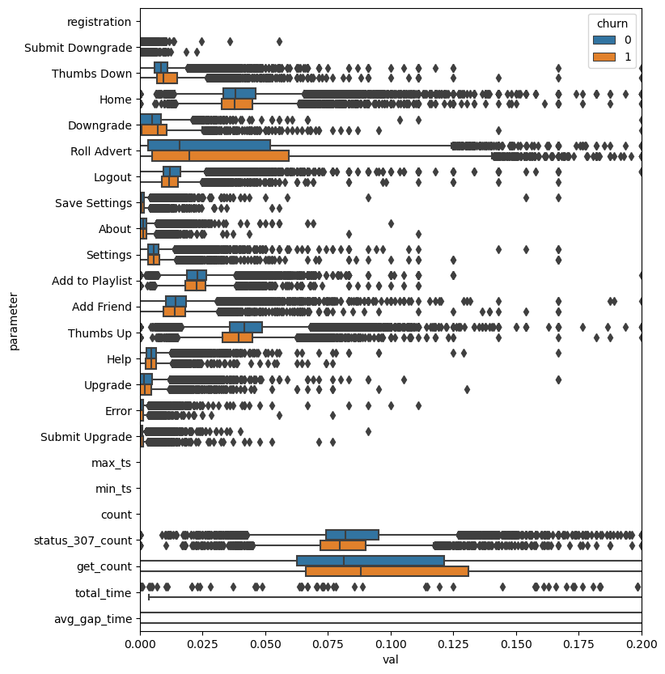
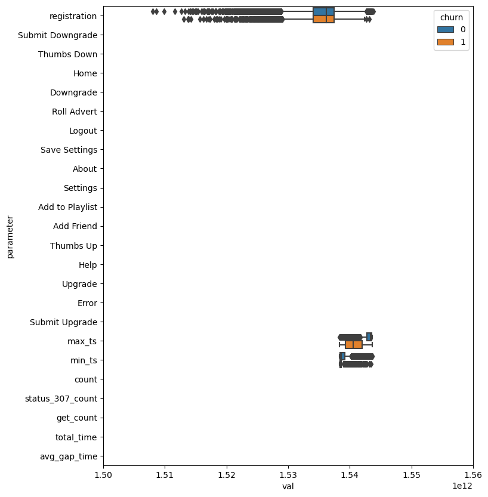
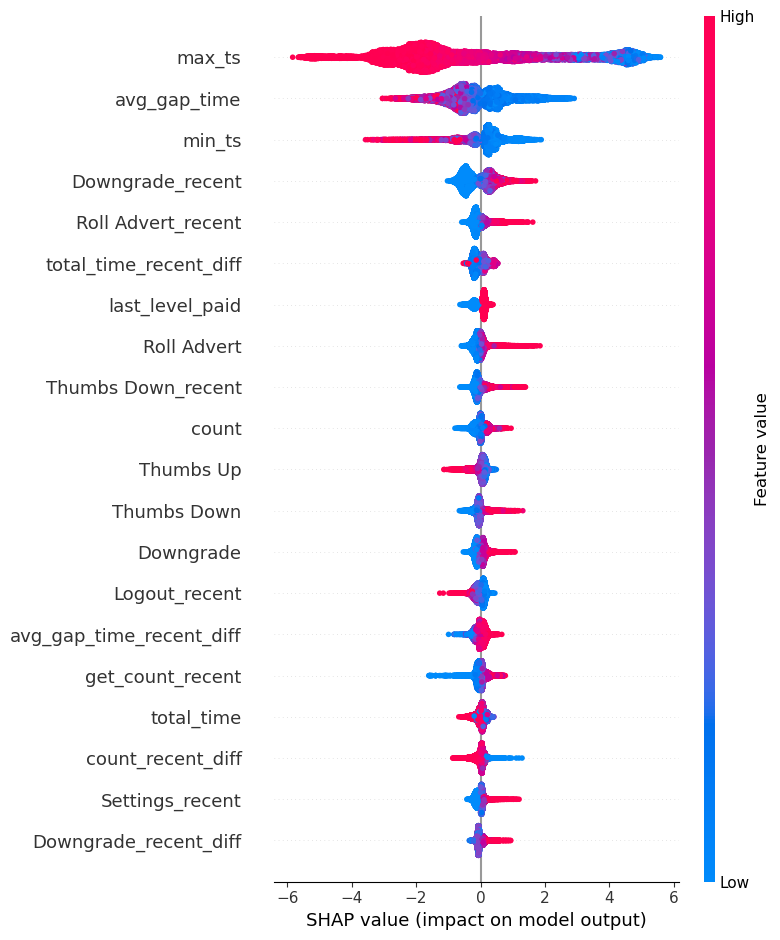

# Sparkify

### Purpose
This is the capstone project for Udacity Data Scientist Nanodegree. The purpose is to predict whether a user will "churn" or not. "churn" here is defined as users that confirm cancellation of services. 

### Files for examination
+ **modeling-final-full_dataset-new-no-state.ipynb**: the final notebook for modeling

+ **shap-analysis**: shap value analysis on the preferred xgboost model

+ **README.md**: a readme file that documents all necessary processing steps, including description of the original dataset, EDA and feature engineering, modeling and shap-value analysis.

For completeness, some other files are also included but probably not useful for examination:

+ ETL-pyspark-full_dataset.ipynb: the complete pipeline for doing feature extraction from the original dataset to the assembled csv file using PySpark.

+ cv_result_analyzer.py: helper class to analyzer cross-validation results.


### Dataset
The dataset simulates a song streaming service and is about 12GB. The dataset is in JSON format and a typical line is:

```
{"ts":1538352117000,"userId":"30","sessionId":29,"page":"NextSong","auth":"Logged In","method":"PUT","status":200,"level":"paid","itemInSession":50,"location":"Bakersfield, CA","userAgent":"Mozilla/5.0 (Windows NT 6.1; WOW64; rv:31.0) Gecko/20100101 Firefox/31.0","lastName":"Freeman","firstName":"Colin","registration":1538173362000,"gender":"M","artist":"Martha Tilston","song":"Rockpools","length":277.89016}
```

Besides standard user information fields, some unique fields for this dataset include:

1. The page ("page") the user clicked on, which is one of the following (shown together with the corresponding counts):

```
+-------------------------+--------+
|page                     |count   |
+-------------------------+--------+
|NextSong                 |20850272|
|Thumbs Up                |1151465 |
|Home                     |933124  |
|Add to Playlist          |597921  |
|Roll Advert              |385212  |
|Add Friend               |381664  |
|Logout                   |296005  |
|Thumbs Down              |239212  |
|Downgrade                |184240  |
|Settings                 |147074  |
|Help                     |129448  |
|Upgrade                  |50507   |
|About                    |48377   |
|Save Settings            |29516   |
|Error                    |25048   |
|Submit Upgrade           |15135   |
|Submit Downgrade         |6494    |
|Cancel                   |5003    |
|Cancellation Confirmation|5003    |
+-------------------------+--------+
```
2. Timestamp ("ts") and sessionId ("sessionId"), which can be combined to estimate how long a user tends to stay for the session before he/she logs out.

3. Web request method ("method") and response status ("status"). The "method" can be either "GET" or "PUT", with "GET" corresponding to "HOME", "Roll Advert", "Downgrade","Settings", "Help", "Upgrade", "About" and "Error", while "PUT" corresponding to the other possible values in the "page" field. It thus offers a convenient way to group the types of the pages a user visited. Similarly, "status" is either "307" or "200", with "307" corresponding to "Thumbs Up", "Add Friend", "Logout", "Thumbs Down", "Save Settings", "Submit Upgrade", "Submit Downgrade" and "Cancel".

4. "level" is either "paid" or "free" and indicates whether the user is a registered (paid) member or not. The initial level ("first_level") and the last level ("last_level") of membership status of each user are used as input features.

### EDA and Feature engineering
The dataset is larger than my laptop's memory. I therefore need to use pyspark to extract features that I think would be important in predicting churn. The output is converted to a pandas dataframe (only ~15Mb) for further modeling. A few things that need to be careful here are:

1. There is a danger of constructing a lot of highly correlated features. For example, for a specific user, the counts he/she clicks the "NextSong", total number of sessions and total hours he/she uses the streaming services are highly correlated, with correlation coefficient greater than 0.89. I choose to keep only the counts of "NextSong" to reduce both the feature numbers and the risk of getting meaningless answers in logistic regression.

2. Instead of looking at the absolute counts of different pages one visits, I find it useful to normalize these counts using the "NextPage" counts. This not only makes the numbers easier to interpret, but also better reflects the user's distribution of page activities within a session. A quick look on how these feature affects the churn rate is below:



3. Interestingly, the mean of the registration time is about the same for the "churn" group and the "no-churn" group. However, the latest time stamp (max_ts) for 'no-churn' users is significantly larger than 'churn' users.



The main function of feature engineering is copied here for documentation purposes. df is the spark dataframe corresponding to the original dataset.

```
def get_features(df):
    
    g = df.groupby('userId')
    
    # get the total session time
    output = df.groupby('userId','sessionId').agg(((F.max('ts')-F.min('ts'))/3600/1000).alias('hour')).\
                groupby('userId').agg(F.sum('hour').alias('total_session_time')).toPandas()
    
    # total time and page counts
    tmp = g.agg(*[F.sum(F.when(F.col('page')==action, 1)).alias(action) for action in actions],
                  F.max('ts').alias('max_ts'),
                  F.min('ts').alias('min_ts'),
                  F.count_distinct('sessionId').alias('session_counts'),
                  F.count('*').alias('count'),
                  F.count(F.when(F.col('status')==307, 1)).alias('status_307_count'),   
                  F.count(F.when(F.col('method')=='GET', 1)).alias('get_count')).na.fill(0).toPandas()
    output = pd.merge(output, tmp, on='userId')
    output['total_time'] =  (output['max_ts'] - output['min_ts'])/3600./1000.
    
    # gap time
    output['avg_gap_time'] = (output['total_time'] - output['total_session_time']) / (output['session_counts'] - 1)
    output.loc[output.session_counts==1, 'avg_gap_time'] = 0.0
    output.drop(columns=['total_session_time', 'session_counts'], inplace=True)
    
    # normalize by count
    for action in actions:
        if action != 'NextSong':
            output[action] = output[action] / output['count']
    output.drop(columns=['NextSong'], inplace=True)
    output['status_307_count'] = output['status_307_count'] / output['count']
    output['get_count'] = output['get_count'] / output['count']
    
    # first and last level
    tmp = df.orderBy('userId','ts').groupby('userId').agg(F.first('level').alias('first_level'),
                                                          F.last('level').alias('last_level')).toPandas()
    output = pd.merge(output, tmp, on='userId')    
    
    return output
```

4. To look at how these features change over time, I also include the "recent" values of these features, with "recent" defined as the last 20% of visits. The complete list of final features in the assembled dataset is therefore:

```
['userId', 'churn', 'location', 'agent', 'gender', 'registration',
       'Submit Downgrade', 'Thumbs Down', 'Home', 'Downgrade', 'Roll Advert',
       'Logout', 'Save Settings', 'About', 'Settings', 'Add to Playlist',
       'Add Friend', 'Thumbs Up', 'Help', 'Upgrade', 'Error', 'Submit Upgrade',
       'max_ts', 'min_ts', 'count', 'status_307_count', 'get_count',
       'total_time', 'avg_gap_time', 'first_level', 'last_level',
       'Submit Downgrade_recent', 'Thumbs Down_recent', 'Home_recent',
       'Downgrade_recent', 'Roll Advert_recent', 'Logout_recent',
       'Save Settings_recent', 'About_recent', 'Settings_recent',
       'Add to Playlist_recent', 'Add Friend_recent', 'Thumbs Up_recent',
       'Help_recent', 'Upgrade_recent', 'Error_recent',
       'Submit Upgrade_recent', 'count_recent', 'status_307_count_recent',
       'get_count_recent', 'total_time_recent', 'avg_gap_time_recent']

```

5. After step 4, the dataset is small enough to handle using pandas. Categorical features "agent", "gender", "first_level" and "last_level" are one_hot encoded with drop_first=True. "location" is dropped for now as there are too many locations to handle. 

6. The differences between recent and total page activity counts are calculated and added to the features.

### Modeling
For this exercise, I test 4 models: random forest, logistic regression, svc and xgboost. For logistic regression and svc, Powertransforms on features are needed. Balanced weighting is used for all 4 models. f1_score is used as the main metric in the cross-validation step while roc-auc is also checked manually.  

The final f1_score using the best parameter(s) for each model is 0.850, 0.802, 0.820 and 0.854 for random forest, logistic regression, svc and xgboost model respectively. I have also tried a stacking model, which has an f1_score of 0.850 and is not better than the single random forest or xgboost model. This may be due to the lower f1_score for the logistic regression and svc models.

### Business insight
This is most clearly seen in the shap analysis plot using the xgboost model. The following plot shows the top 20 most important features:



So these are the customers with higher probabilities to churn:

1. max_ts: with small max_ts value, which means relatively new users. However, be careful that this might be due to sampling bias as these are naturally related to users already "churned".

2. avg_gap_time: This is somewhat counterintuitive. Customers with shorter gap time in between sessions are more likely to churn. 

3. downgrade_recent: Once a customer downgrades his/her service, it's more likely to finally cancel the service.

4. roll_avert: It's not clear from the documentation what this means. But it's clear that when this happens, the customer is more likely to churn.

5. last_level_paid: Well, this just means free service is preferred.

6. thumbs_down: This is probably the most expected feature. Maybe we need to give some discounts when users keep pressing the thumbs-down button?

### Notes on some procedures that may seem uncommon
1. For xgboost  
Normally, one would also tune the n_estimators with the other parameters using cross-validation. However, I believe it is better to use the eval_set with early_stopping_rounds. By doing so, the best n_estimators can be found at the point where the validation error just starts to rise and without extra tuning. A special class CV_xgboost is written for this purpose. It inherits from CVResultAnalyzer and helps to produce figures as in out[28] and tables as in out[29], but not needed if fitting the xgboost model is the only concern.   
Another advantage for using this class is that it essentially generates a suite of xgboost models (same number as the number of folds), and can apply bagging at the end. My experience is it can reduce the error by about 0.002 in f1 or auc score.  


2. For stacking  
Normally, say we have 3 models, one would fit each model to the entire dataset, generate predicted probabilities for each model, then apply cross-validation to tune the stacking model being fit on these probabilities. I normally just use logistic regression for the stacking model, but one can use other models as well.  
However, there is some data leakage in this procedure. The reason is that each of the 3 models have already seen the entire dataset, thus the validation set in the cv for the stacking model is not completely safe. The Stacker class is written to get around this problem by only fitting the initial 3 models on the training set for each split. But at the end of the day, the improvement is fairly small and this class is mainly used as a conceptually safe guard.
